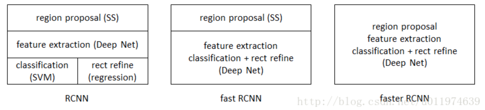
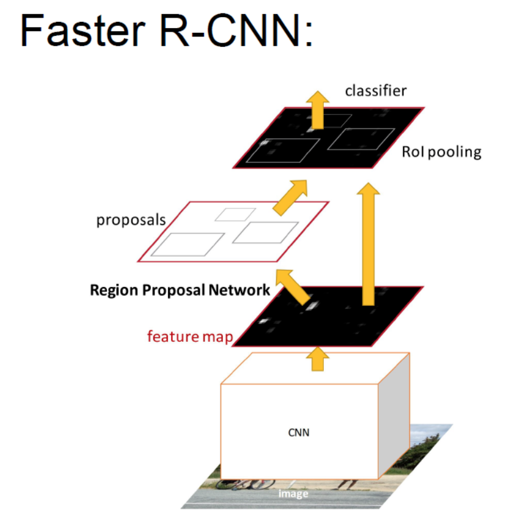
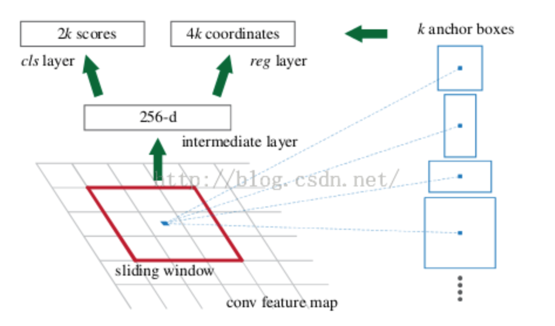
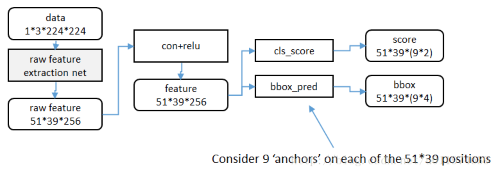

### faster rcnn

#### 一 简介

#### 二 faster rcnn组成

（1）深层的全卷积网络用于区域推荐（代替fast rcnn）中的selective search方法

（2）faster rcnn检测器

#### 三 如何设计/训练区域生成网络

RPNs: Region Proposal Networks（区域推荐网络）

在最后的卷积层之后添加了一层RPN，RPN通过训练之后直接生成推荐区域；在RPN之后，是ROI池化层以及分类器和回归器（类似于fast rcnn）。

RPN网络基本设想是：在提取好的特征图上，通过滑动窗口获取特征向量，然后输出到两个全连接层：

* 一个是回归器
* 另一个是分类器

#### 四 RPN

上图是RPN的网络流程图，即也是利用了SPP的映射机制，从**conv5**的特征图上进行滑窗来替代从原图滑窗。在feature map上会有一个sliding window,这个sliding window会遍历feature map上的每一个点，并且在每个点上配置k个anchor boxes。

* 在每个位置用N个anchor boxes
* anchors是平移不变的，在每个位置的ancors都一样
* 回归器的结果是anchor boxes的偏移
* 分类器的结果是每个回归之后anchor所属类别的概率

#### 五 Anchors

* 在每一个滑动窗口的位置，同时预测k个推荐区域，所以回归层有4k个输出（平移和缩放操作），分类器层有2k个得分（对应每个区域是目标和非目标的概率）。

* k个推荐区域对应k个参考框的参数形式，称为anchors。每个anchor以当前滑动窗口的中心为中心。默认使用3种尺度和3种长宽比，这样每个滑动窗口位置对应k=9个anchor。如果特征图大小为$W*H$，则总共对应$WHk$个anchor。

* 总体思路：先通过spp将点从conv5映射回原图，设计不同的固定初始尺寸训练一个网络，然后根据gt和它的覆盖率设置正负标签，从而让它学习里面是否有正负标签。那么如何降低这个思路的复杂度呢？

* 降低复杂度：固定尺度，固定缩放比例，固定采样方式。三种面积*三种长宽比例$\{128^2,256^2,512^2\} * \{1:1,1:2,2:1\}$

* 候选区域生成网络的训练数据：

  （1）anchors和gt box有着最高iou的记为正样本

  （2）剩下的anchors与任何gt box的iou大于0.7记为正样本；如果和**任意**一个object的iou小于0.3记为负样本

  （3）剩下的弃之不用

* 损失函数和fast-rcnn相似

