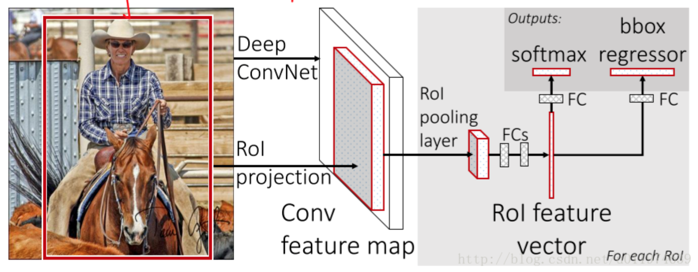
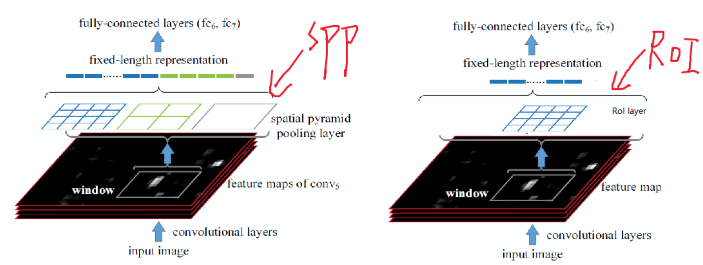
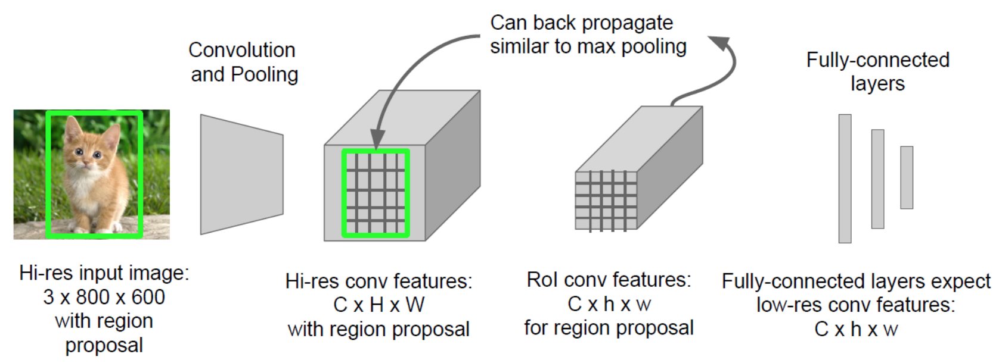
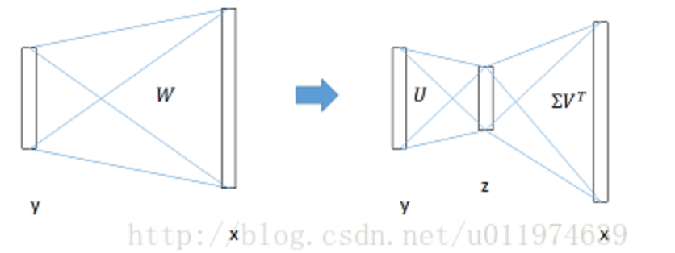

### Fast RCNN

基础：sppnet上继续优化

注：fast rcnn用的也是selective search选取一系列候选区域

#### 一 出发点

rcnn存在的问题：

（1）速度慢，需要将每一个roi通过cnn网络

（2）训练cnn和训练svm及bbox回归时分阶段完成的，因此训练svm和bbox回归时无法更新前面cnn的参数，模型精度上不去。

（3）训练消耗大量的时间和空间，候选区域经过cnn得到的特征向量要存在磁盘中，然后在训练svm和bbox回归时再取出来，这需要大量的时间和空间，因为存取两个操作费时。

sppnet存在的问题：

（1）和rcnn一样分阶段训练，训练cnn和训练svm及bbox回归时分阶段完成的，因此训练svm和bbox回归时无法更新前面cnn的参数，模型精度上不去。

（2）特征需要写入磁盘。

#### 二 fast rcnn改进

将模型分成两步：

（1）选取候选区域

（2）提出一个Roi层，整合了整个模型，把cnn，变换层，svm，bbox回归几个模型整合一起，同时对它们进行训练。

#### 三 具体架构

* 输入为全图和一组候选区域，和sppnet一样，全图塞进去得到一个全图的特征图
* 和sppnet类似，将图片的候选区域映射到feature map对于的区域，然后将该区域传给roi层得到固定大小的特征向量
* 每个特征向量传给fc，最后分成两个分支，一个为处理softmax概率，有K+1类；另一个做bbox回归

#### 四 roi层如何工作

**RoI层是特殊的SPP层，RoI层是使用单个尺度的SPP层**(为什么不用多个尺度的原因是多个尺度准确率提升不高，但是计算量成倍的翻)

注：roi层是将每个候选区域进行处理的！

#### 五 整合

多任务损失函数：

$$
L(p,k^*,t,t*) = L_{cls}(p,k^*) + \lambda[k^* \ge 1] L_{loc}(t,t^*)
$$
其中，一个输出层对每个roi输出离散的概率分布：$p=(p_0,…,p_K)$，假设0是背景类。

一个输出层输出bounding box回归的位移：$t_k=(t_x^k,t_y^k,t_w^k,t_h^k)$，k为类别的索引。$k^*$和$t^*$表示真实类别和真实回归值。

#### 六 样本选取

* SPPNet只能微调SPP层后面的全连接层，再采用SGD方法训练的过程中，而**SPPNet的会在多张图片上选取候选区域，这里在反向传播的过程中会大量耗费内存和时间**。Fast R-CNN采用SGD训练，每次采样在N个图片的基础上选取R个候选区域，**实验选取的N=2，R=128.这样样本数据来自与2张图片，这比R-CNN和SPPNet选取的样本在训练速度上快了很多倍**。

* 使用奇异值分解为fc层提速，在检测过程中，因为要处理的RoIs较多，几乎过半的时间都耗费在FC层的计算上了，这里是用SVD分解加速FC层的计算。微小降低精度，但速度提高30%。

