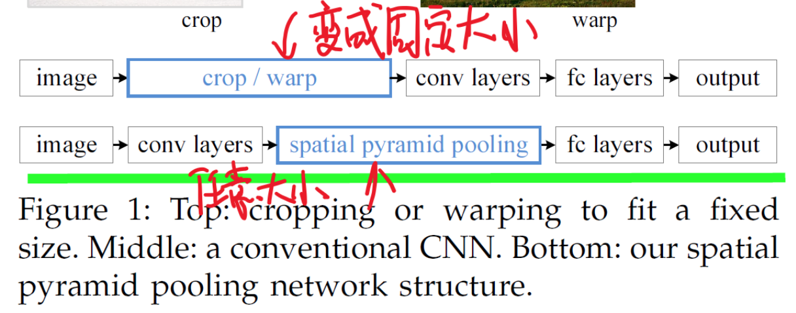
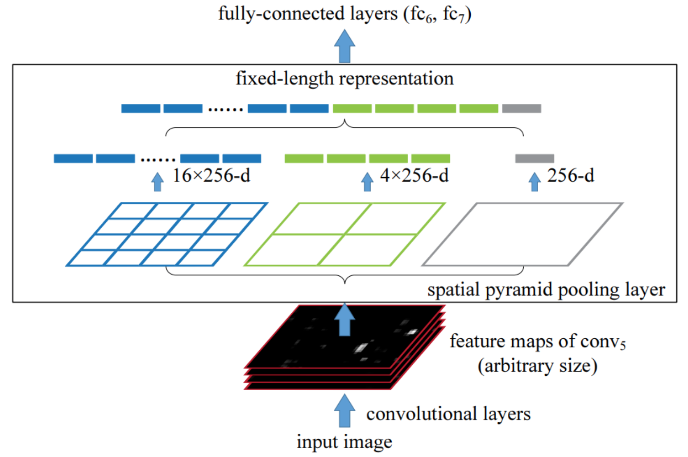
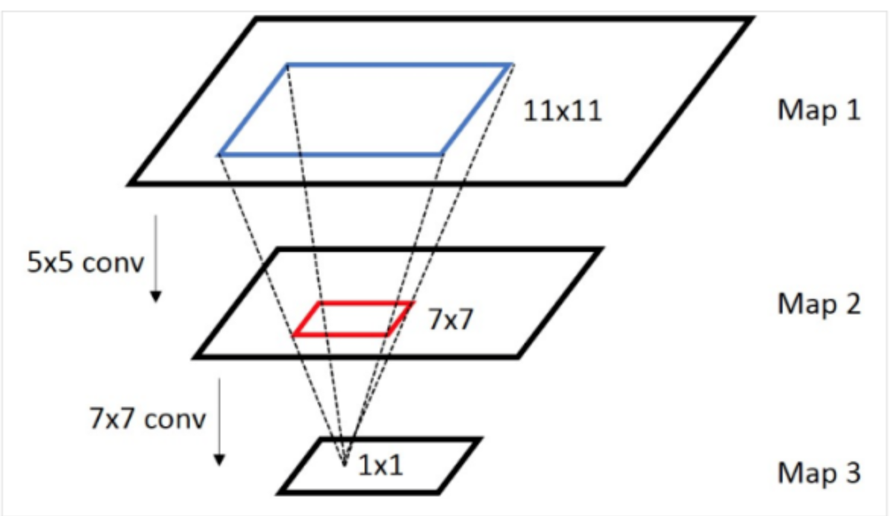

### SPPNet

《Spatial pyramid pooling in deep convolutional networks for visual recognition》空间金字塔变换层

#### 一 简介

主要针对rcnn提出了两点改进：

* cnn的固定输入大小，导致不必要的精度损失
* rcnn模型候选区域在cnn内重复计算，导致计算冗余

#### 二 为什么cnn需要固定大小的输入，sspnet如何做到

cnn主要分成两个部分，前面的部分是卷积层，后面的部分是fc层。卷积层不要求固定大小的输入，但是fc层在设计时就固定了神经元的个数，故需要固定长度的输入。

sppnet的做法如下，

把卷积层和全连接层中的池化层用空间金字塔池化代替，从而输出固定的长度向量。

具体的原理图为：

其中上图256表示卷积层输出的特征图个数，这样每个特征图被分成3子图分，然后每个子图分别分成1乘1，2乘2和4乘4块区域，然后论文对子图的每个区域采用max池化，这样得到的数据长度固定为$21*256$的特征向量。

#### 三 利用全图的feature map映射出候选区域的特征向量

* 感受野

指某一层输出结果中一个元素所对应的上一层的区域大小

| 类型   | 大小          |
| ---- | ----------- |
| 输入尺寸 | $W_1*H_1$   |
| 卷积核  | $F * F$     |
| 输出尺寸 | $W_2 * H_2$ |
| 步长   | stride：S    |
| 填充大小 | padding：P   |

$$
W_2 = \frac{W_1-F+2P}{S} + 1 \\
H_2 = \frac{H_1-F+2P}{S}+1
$$

因此：
$$
W_1 = (W_2-1)S - 2P + F \\
H_1 = (H_2-1)S - 2P + F \\
$$

假设有四层的卷积层，每一层有3个参数$(a,b,c)$，a表示滤波器的大小F，b表示步长S，c表示padding，注在计算感受野大小时，忽略了padding的大小。

第一层到最后一层的参数为：

（11，4，0），（3，2，0），（5，1，2），（3，2，0）

假设第四层只有一个元素，那么按照计算公式2可得：
$$
size1 = (1-1) *2 + 3 =3 \\
size2 = (3-1)*1 + 5 = 7 \\
size3 = (7-1)*2 + 3 = 15 \\
size4 = (15-1)*4 + 11 = 67
$$
因此，对应的感受野大小为67*67。

这样原始的roi区域映射到feature map对于的区域，从而拿到对于的值。