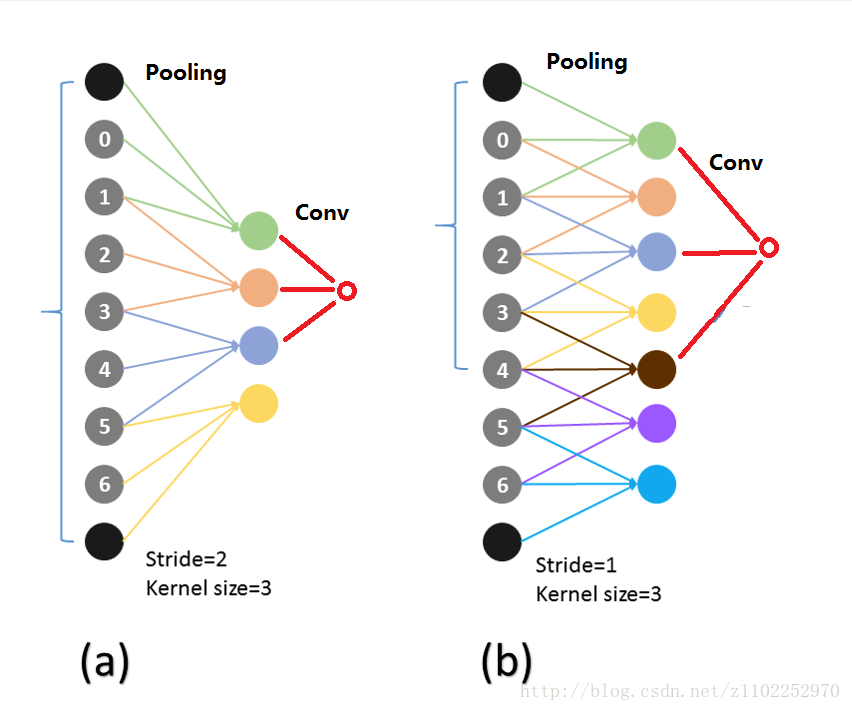

### SSD：Single Shot MultiBox Detector

#### 1 摘要

SSD 将输出一系列 离散化（discretization） 的 bounding boxes，这些 bounding boxes 是在 不同层次（layers） 上的 feature maps 上生成的，并且有着不同的 aspect ratio（高宽比）。

在prediction阶段：

* 计算每个default box中的物体属于每个类别的可能性，即score
* 对bounding boxes的形状进行微调
* 结合不同分辨率的特征图的预测来处理相同物体不同尺寸的情况

特点：ssd取消了建议区域生成，像素重采样和特征重采样，从而更容易进行优化训练

主要贡献：

* 核心是预测物体机器归属类别的得分，同时在feature map上使用小的卷积核，来预测一些列bounding boxes的偏移。
* 为了得到高精度的检测结果，在不同层次的特征图上预测物体和box offset，同时得到不同aspect ratio的预测。

#### 2 详解框架

* feature map cell：将feature map切分成8 * 8或者4 * 4之后的小格子
* default box：每个格子上，一系列固定大小的box（类似yolo中的anchor box），如下图中的虚线框，即代表default box。

##### 2-1 model

ssd基于一个cnn网络，产生一系列**<u>固定大小</u>**的bounding boxes，以及每个box包含物体实例的可能性，即score。之后进行非极大值抑制nms，得到最终的预测值。

ssd模型的最开始部分，称作base network，即用于图像分类的标准架构。在这个基础网络之后，添加了额外的辅助结构。

* **Multi-scale feature maps for detection** 
  在基础网络结构后，添加了额外的卷积层，这些卷积层的大小是逐层递减的，可以在多尺度下进行 predictions。
* **Convolutional predictors for detection** 
  每一个添加的特征层（或者在基础网络结构中的特征层），可以使用一系列 convolutional filters，去产生一系列固定大小的 predictions，见下图。对于一个大小为 m×n，具有p通道的特征层，使用的 convolutional filters 就是3×3×p的 kernels。产生的 predictions，要么就是归属类别的一个得分，要么就是相对于 default box coordinate 的 shape offsets。 在每一个m×n的特征图位置上，使用上面的3×3的 kernel，会产生一个输出值。bounding box offset 值是输出的 default box 与此时 feature map location 之间的相对距离（YOLO 架构则是用一个全连接层来代替这里的卷积层）。
* **Default boxes and aspect ratios** 
  每一个 box 相对于与其对应的 feature map cell 的位置是固定的。 在每一个 feature map cell 中，我们要 **predict** 得到的 box 与 default box 之间的 offsets，以及每一个 box 中包含物体的 score（每一个类别概率都要计算出）。 因此，对于一个位置上的k个boxes 中的每一个 box，我们需要计算出c个类，每一个类的 score，还有这个 box 相对于 它的默认 box 的 4 个偏移值（offsets）。于是，在 feature map 中的每一个 feature map cell 上，就需要有(c+4)×k个 **filters**。对于一张m×n大小的 feature map，即会产生(c+4)×k×m×n个输出结果。

##### 2-2 训练

样本和标签：ssd训练图像中的gt需要赋予到那些固定输出的boxes上，住ssd输出的是事先定义好的，一系列固定大小的bounding boxes。如下图所示，需要将狗的gt box赋予到c图中的红色虚线框。

这样子，就将训练图像中的gt和固定输出的boxes对应，从而可以进行端到端的损失函数的计算和反向传播算法。

那么我们将面对以下问题：

* 如何选择一系列的default boxes
* scales的选择问题
* hard negative mining问题

##### 2-3 匹配策略

* 如何将gt boxes和default boxes进行配对，构成标签？

在开始的时候，用 [MultiBox](http://arxiv.org/abs/1312.2249) 中的**<u>best jaccard overlap</u>**来匹配每一个 ground truth box 与 default box，这样就能保证每一个 groundtruth box 与唯一的一个 default box 对应起来。但是又不同于 [MultiBox](http://arxiv.org/abs/1312.2249) ，本文之后又将 default box 与任何的 groundtruth box 配对，只要两者之间的 jaccard overlap 大于一个阈值，这里本文的阈值为 0.5。 jaccard是类似于iou这样评判的一个标准。

##### 2-4 目标函数

$x_{ij}^p=1$：表示第i个default box和类别p的第j个gt box相匹配，若不匹配，则$x_{ij}^p=0$，因此一定有$\sum_ix_{ij}^p\ge1$，即对于第j个gt box，有可能有多个default box和其相匹配。

从而可得总的目标损失函数：
$$
L(x,c,l,g) = \frac{1}{N}(L_{confidence}(x,c) + \alpha L_{loc}(x,l,g))
$$

* N是和gt相匹配的default boxes个数，
* localization loss（loc） 是 [Fast R-CNN 中 Smooth L1 Loss](http://arxiv.org/abs/1504.08083)，用在 predict box（l） 与 ground truth box（g） 参数（即中心坐标位置，width、height）中，从而回归 bounding boxes 的中心位置，以及 width、height
* confidence loss（confidence） 是 Softmax Loss，输入为每一类的置信度c
* 权重项$\alpha$，设置为 1

##### 2-5 选择default boxes的scales和宽高比

为了处理不同尺度的物体，可以选择将图像转换成不同的尺度，将这些图像独立地通过cnn进行处理，最后将结果进行综合。ssd的做法是使用同一个网络中的不同层上的特征图，也可以达到相同的效果。

**原理**：一般来说，一个 CNN 网络中不同的 layers 有着不同尺寸的 感受野（receptive fields）。这里的感受野，指的是输出的 feature map 上的一个节点，其对应输入图像上尺寸的大小。

所幸的是，SSD 结构中，default boxes 不必与每一层 layer 的 receptive fields 对应。本文的设计中，feature map中特定的位置，来负责图像中特定的区域，以及物体特定的尺寸。假如我们用m个feature maps 来做 predictions，每一个 feature map 中 default box 的尺寸大小计算如下： 
$$
s_k = s_{min} + \frac{s_{max}-s_{min}}{m-1}(k-1), k\in[1,m]
$$

* $m$表示m个特征图
* $s_{min} $为0.2，$s_{max} $为0.95，意味着最底层尺度为0.2（k=1），最高层为0.95（k=m），再用不同宽高比$a_r$的default boxes，$a_r = [1,2,3,\frac{1}{2}, \frac{1}{3}]$，这样每个default boxes的宽，高都可以计算出来了：

$$
a_r = \frac{w_k^a}{h_k^a} \\ 
w_k^a * h_k^a = s_k^2 = h_k^a*h_k^a*a_r
$$

从而可得：
$$
w_k^a = s_k \sqrt{a_r} \\
h_k^a = \frac{s_k} {\sqrt{a_r}}
$$
对应宽高比为1时，文字还增加了一个default boxes，$s_k'=\sqrt{s_ks_{k+1}}$，所以最终有6个default boxes。

每个default box的中心，设置为$\frac{i+0.5}{|f_k|}, \frac{j+0.5}{|f_k|}$，其中$|f_k|$是第k个特征图的大小，$i,j\in[0, |f_k|]$

##### 2-6 hard negative mining

在生成一系列的 predictions 之后，会产生很多个符合 ground truth box 的 predictions boxes，但同时，不符合 ground truth boxes 也很多，而且这个 negative boxes，远多于 positive boxes。这会造成 negative boxes、positive boxes 之间的不均衡。训练时难以收敛。

因此，本文采取，先将每一个物体位置上对应 predictions（default boxes）是 negative 的 boxes 进行排序，按照 default boxes 的 confidence 的大小。 选择最高的几个，保证最后 negatives、positives 的比例在3:1。

文章通过实验发现，这样的比例可以更快的优化，训练也更稳定。 

##### 2-7 数据增强

提高了实验效果

##### 2-8 hole filling algorithm？？？

带洞卷积：

图(a)展示是传统的过程，经过3x3-s2的pooling后，接一个3x3的conv，那么卷积层的一个神经元感受野是7 
图(b)是atrous过程，现在Pooling层是3x3-s1，后面的卷积层为了能够使用原来的参数初始化必须使用带孔的卷积，这里卷积层的一个神经元的感受野也是7。

#### 3 inference

本文的方法一开始会生成大量的 bounding boxes，所以有必要用 Non-maximum suppression（NMS）来去除大量重复的 boxes。通过设置 confidence 的阈值为0.01，我们可以过滤掉大多数的 boxes。

之后，我们再用 [Thrust CUDA library](http://docs.nvidia.com/cuda/thrust/#axzz4Knxgge9X) 进行排序，用 GPU 版本的实现来计算剩下的 boxes 两两之间的 overlap。然后，进行 NMS，每一张图像保留 top 200 detections。这一步 SSD300 在 VOC 20类的每张图像上，需要耗时2.2 msec。

#### 4 ssd网络结构优劣分析

SSD算法的优点应该很明显：运行速度可以和YOLO媲美，检测精度可以和Faster RCNN媲美。这里谈谈缺点：

* 需要人工设置prior box的min_size，max_size和aspect_ratio值。网络中default box的基础大小和形状不能直接通过学习获得，而是需要手工设置。而网络中每一层feature使用的default box大小和形状恰好都不一样，导致调试过程非常依赖经验。(相比之下，YOLO2使用聚类找出大部分的anchor box形状，这个思想能直接套在SSD上)
* 虽然采用了pyramdial feature hierarchy的思路，但是对小目标的recall依然一般，并没有达到碾压Faster RCNN的级别。可能是因为SSD使用conv4_3低级feature去检测小目标，而低级特征卷积层数少，存在特征提取不充分的问题。因为对于小目标而言，经过多层卷积之后，就没剩多少信息了。虽然提高输入图像的 size 可以提高对小目标的检测效果，但是对于小目标检测问题，还是有很多提升空间的。

