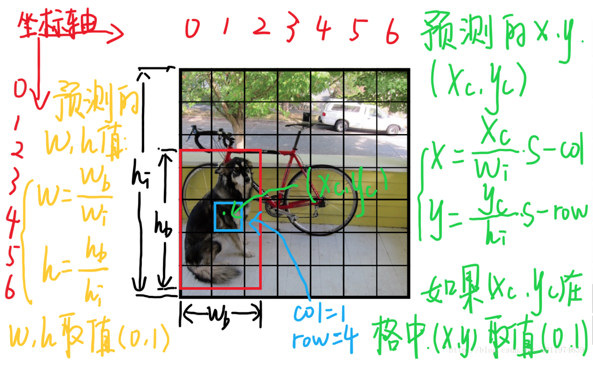

### yolo《You only look once: unified, real-time object detection》

#### 一 简介

现存的物体检测模型：

* 准确度差（dpm速度可以，但是准确率差）
* 速度慢（faster rcnn准确度快，但速度为3fps）

rcnn系列慢的原因：**模型把物体检测任务分为了多个阶段，而这几个阶段需要分开训练，难以优化(虽然Faster R-CNN是一个整体的网络，但是训练的时候还是需要交替训练)。**

YOLO在此基础上重建了整个模型框架，将原先的Region Proposal一套方案抛弃掉，将object detection作为回归问题来处理，模型能够接收原始像素直接输出object的bbox和类别categories，也就是`end-to-end`模型.

#### 二 yolo简单流程

* 将整个图片缩放到指定大小
* 输入到cnn中
* 使用非极大值抑制去除多余框，得到最后结果

（1）将图片缩放到448*448大小，在把整个图片分成$S * S$个单元格（论文中选7\*7），此后以每个单元格为单位进行预测分析。每个单元格的大小为64\*64。

（2）每个单元格需要做三件事

* 如果一个物体的中心落在某个单元格上，那么这个单元格负责预测这个物体。
* 每个单元格需要预测B个bbox值（坐标，宽高，置信度），即每个单元格需要预测$B*5$个值
* 每个单元格需要预测C个条件概率值，C代表物体种类个数。

**说明**：每个bounding box要预测(x, y, w, h)和confidence共5个值，每个网格还要预测一个类别信息，记为C类。则SxS个网格，每个网格要预测B个bounding box还要预测C个categories。输出就是<u>**S x S x (5*B+C)**</u>的一个tensor。 注意：class信息是针对每个网格的，confidence信息是针对每个bounding box的。

#### 三 单元格分析

单元格需要预测B个$(x,y,w,h,confidence)$

* $(x,y)$是bbox的中心相对于单元格左上角的偏移

$$
x = \frac{x_c}{w_i}S-x_{col} \\
y = \frac{y_c}{h_i}S-y_{row}
$$

其中，$x_c,y_c$为bbox的中心坐标，即红框的中心坐标。$w_i,h_i$是图片的宽和高，$x_{col},y_{row}$表示中心点所在单元格的位置。

* $(w,h)$是bbox相对于整个图片的比例

$$
w = \frac{w_b}{w_i} \\
h = \frac{h_b}{h_i}
$$

其中，$w_b,h_b$为bbox的宽和高。

* 置信度

置信度包含两个含义：一是格子内是否有目标，二是bbox的准确度。
$$
confidence = Pr(Object) * IOU_{pred}^{truth}
$$
如果格子内有物体，则$Pr(Object)$=1，此时置信度等于iou，否则置信度等于0。

* C个种类的概率值

$$
Pr(Class_i|Object)
$$

注：输出的种类概率值是针对网络的，不是针对bbox的，所以每个网格只会输出C个种类信息。(这样就是默认为一个格子内只能预测一种类别的object了，简化了计算，但对于检测小object很不利，一个格子含有多个objects)。

在预测时，对confidence进行以下计算得到class-specific confidence scores：
$$
Pr(Class_i|Object) * Pr(Object) * IOU_{pred}^{truth} = Pr(Class_i) * IOU_{pred}^{truth}
$$
（5）式既包含预测的类别信息，也包含了对bbox值得准确度，可以设置一个阈值，过滤掉低分的class-specific confidence scores，剩下的经过极大似然估计，得到最终的标定框。

* 单元格输出

$S * S * (5B + C)$：论文中B=2，C=20，最终的输出为7\*7\*20的向量。

#### 四 详细流程

中间的bbox和confidence如何实现？

最终模型：

* 预训练

使用上图的前20个卷积层+平均池化+FC层在ImageNet上跑了一圈。(在ImageNet上跑是用的224×224输入)。

预训练完事后，也就是得到了想要的前20个卷积层权重，在此基础上添加4个卷积层和2个FC层，得到最终模型(也就是上图)。同时将网络的输入尺寸从224×224改成了448×448。

#### 五 损失函数

均方和误差损失函数。

主要需要考虑3个方面：8维bbox的坐标，2维bbox的置信度和20维的类别概率误差。

简单地叠加三个方面的损失，则会出现下面问题：

* 第一，8维的localization error和20维的classification error同等重要显然是不合理的； 
* 第二，如果一个网格中没有object（一幅图中这种网格很多），那么就会将这些网格中的box的confidence设为0，相比于较少的有object的网格，这种做法是压倒性(overpowering)的，这会导致网络不稳定甚至发散。 

解决：

* 更重视坐标预测，赋予更大的权重，5.0
* 对没有object的box的置信度loss，赋予小的权重0.5
* 对于有object的box的置信度loss和类别的loss权重，正常取值1
* 对不同大小的box预测中，相对于大的box的预测偏一点，小box预测偏一点肯定更不能被忍受。为了缓和这个问题，去box的宽和高的平方根。
* 一个网格预测多个box，希望的是每个box预测期专门负责预测某个物体。具体做法是看当前预测的box和gt box中哪个iou大，就负责哪个。

* 这个损失函数中：

（1）只有当某个网格中有object的时候才对类别预测误差进行惩罚

（2）只有当某个box预测器对某个gt box负责的时候，才会对box的坐标误差进行惩罚

每个图片的每个单元格不一定都包含object，如果没有object，那么confidence就会变成0，这样在优化模型的时候可能会让梯度跨越太大，模型不稳定跑飞了。为了平衡这一点，在损失函数中，设置两个参数λcorrd和λnoobj，其中λcorrd控制bbox预测位置的损失，λnoobj控制单个格内没有目标的损失。

#### 六 yolo的缺点

* YOLO对相互靠的很近的物体，还有很小的群体检测效果不好，这是因为一个网格中只预测了两个框，并且只属于一类。
* 对测试图像中，泛化能力偏弱，同一类物体出现的新的不常见的长宽比和其他情况不容易检测识别。
* 由于损失函数的问题，定位误差是影响检测效果的主要原因。尤其是大小物体的处理上，还有待加强。

