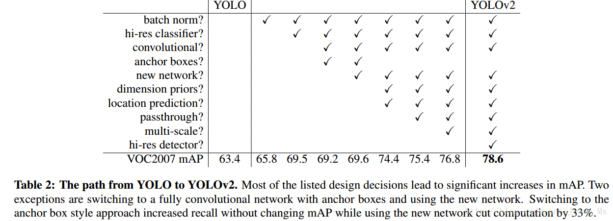
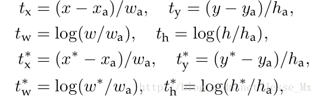
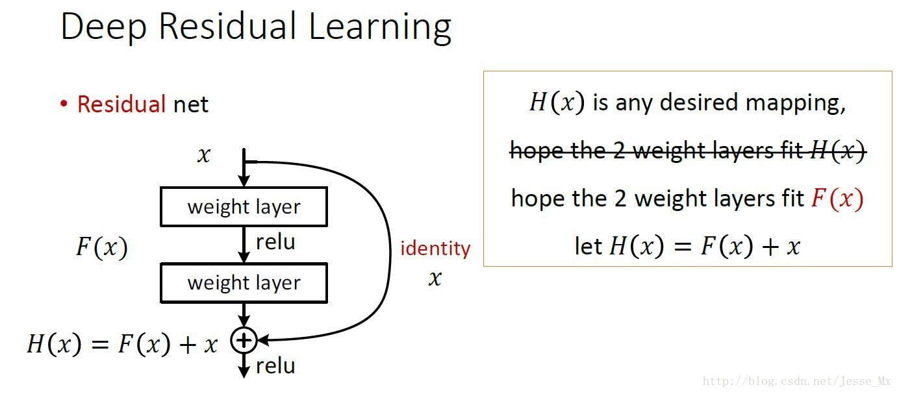

### yolo2《yolo9000:better, faster and stronger》

#### 一 简介（a lot of tricks）

在yolo的基础上，综合多物体检测网络（faster rcnn）和分类网络（resnet，googlenet）的优点。采用联合训练的方式，例如使用imagenet的分类数据集进行分类部分的训练，用coco的数据集训练定位部分。

论文优点主要体现在三个方面：better，faster and stronger三个部分‘

#### 二 better

##### 2-1 batch normalization

使用bn对数据分布进行修正，从而网络可以更快更好地学习。在网络的每个卷积层后增加bn，弃用dropout。

##### 2-2 高分辨率分类器

目前的目标检测方法中，基本上都会使用ImageNet预训练过的模型（classifier）来提取特征，如果用的是AlexNet网络，那么输入图片会被resize到不足256 * 256，导致分辨率不够高，给检测带来困难。为此，新的YOLO网络把分辨率直接提升到了448 * 448，这也意味之原有的网络模型必须进行某种调整以适应新的分辨率输入。

对于YOLOv2，作者首先对分类网络（自定义的darknet）进行了fine tune，分辨率改成448 * 448，在ImageNet数据集上训练10轮（10 epochs），训练后的网络就可以适应高分辨率的输入了。然后，作者对检测网络部分（也就是后半部分）也进行fine tune。这样通过提升输入的分辨率，mAP获得了4%的提升。

##### 2-3 convolutional with anchor boxes

之前的YOLO利用全连接层的数据完成边框的预测，导致丢失较多的空间信息，定位不准。作者在这一版本中借鉴了Faster R-CNN中的anchor思想，回顾一下，anchor是RNP网络中的一个关键步骤，说的是在卷积特征图上进行滑窗操作，每一个中心可以预测9种不同大小的建议框。

为了引入anchor boxes来预测bounding boxes，作者在网络中果断去掉了全连接层。剩下的具体怎么操作呢？首先，作者去掉了后面的一个池化层以确保输出的卷积特征图有更高的分辨率。然后，通过缩减网络，让图片输入分辨率为416 * 416，这一步的目的是为了让后面产生的卷积特征图宽高都为奇数，这样就可以产生一个center cell。作者观察到，大物体通常占据了图像的中间位置， 就可以只用中心的一个cell来预测这些物体的位置，否则就要用中间的4个cell来进行预测，这个技巧可稍稍提升效率。最后，YOLOv2使用了卷积层降采样（factor为32），使得输入卷积网络的416 * 416图片最终得到13 * 13的卷积特征图。

加入了anchor boxes后，可以预料到的结果是召回率上升，准确率下降。我们来计算一下，假设每个cell预测9个建议框，那么总共会预测13 * 13 * 9 = 1521个boxes，而之前的网络仅仅预测7 * 7 * 2 = 98个boxes。具体数据为：没有anchor boxes，模型recall为81%，mAP为69.5%；加入anchor boxes，模型recall为88%，mAP为69.2%。这样看来，准确率只有小幅度的下降，而召回率则提升了7%，说明可以通过进一步的工作来加强准确率，的确有改进空间。

##### 2-4 dimension clusters

在yolo中，是通过人工设计比例和长度的boxes来进行预测。yolo2对这情况进行了改进，使用k-means聚类对数据集的gt进行聚类。度量尺度采用iou实现：
$$
d(box, centroid) = 1 - IOU(box, centroid)
$$
如果采用欧式距离，那么将会导致gt大的比gt小的更容易受到误差的影响，因为大的框，中心的距离相对于小框的距离更大，因此引起的误差会更大。论文中设置k=5

##### 2-5 direct location prediction（直接位置预测）

使用anchor boxes的其他问题：模型不稳定，尤其是早期迭代的时候。大部分的不稳定现象出现在预测box的中心点$(x,y)$上，在区域建议网络中，预测$(x,y)$以及$(t_x,t_y)$使用的是：
$$
x = (t_x * w_a) - x_a \\
y = (t_y * h_a) - y_a
$$
该公式为：

x为坐标预测值，$x_a$为anchor坐标（预设固定值），$x^*$是坐标真实值，t为偏移量。

这个公式的理解为：当预测$ t_x=1$，就会把box向右边移动一定距离（具体为anchor box的宽度），预测 $t_x=−1$，就会把box向左边移动相同的距离。

这个公式没有任何限制，使得无论在什么位置进行预测，任何anchor boxes可以在图像中任意一点结束（我的理解是，txtx没有数值限定，可能会出现anchor检测很远的目标box的情况，效率比较低。正确做法应该是每一个anchor只负责检测周围正负一个单位以内的目标box）。模型随机初始化后，需要花很长一段时间才能稳定预测敏感的物体位置。

在此，作者就没有采用预测直接的offset的方法，而使用了预测相对于grid cell的坐标位置的办法，作者又把gt限制在了0到1之间，利用logistic回归函数来进行这一限制。

现在，神经网络在特征图（13 *13 ）的每个cell上预测5个bounding boxes（聚类得出的值），同时每一个bounding box预测5个坐值，分别为$ t_x,t_y,t_w,t_h,t_o$ ，其中前四个是坐标，$t_o$是置信度。如果这个cell距离图像左上角的边距为 $(c_x,c_y)$以及该cell对应box（bounding box prior）的长和宽分别为 $(p_w,p_h)$，那么预测值可以表示为：
$$
b_x = \sigma(t_x) + c_x \\
b_y = \sigma(t_y) + c_y \\
b_w = p_w e^{t_w} \\
b_h = p_h e^{t_h}  \\
\sigma(t_o) = Pr(object) * IOU(b, object)
$$

##### 2-6 fine-grained features（细粒度特征）

上述网络上的修改使YOLO最终在13 * 13的特征图上进行预测，虽然这足以胜任大尺度物体的检测，但是用上细粒度特征的话，这可能对小尺度的物体检测有帮助。Faser R-CNN和SSD都在不同层次的特征图上产生区域建议（SSD直接就可看得出来这一点），获得了多尺度的适应性。这里使用了一种不同的方法，简单添加了一个转移层（ passthrough layer），这一层要把浅层特征图（分辨率为26 * 26，是底层分辨率4倍）连接到深层特征图。

这个转移层也就是把高低两种分辨率的特征图做了一次连结，连接方式是叠加特征到不同的通道而不是空间位置，类似于Resnet中的identity mappings。这个方法把26 * 26 * 512的特征图连接到了13 * 13 * 2048的特征图，这个特征图与原来的特征相连接。YOLO的检测器使用的就是经过扩张的特征图，它可以拥有更好的细粒度特征，使得模型的性能获得了1%的提升。（这段理解的也不是很好，要看到网络结构图才能清楚）

补充：关于passthrough layer，具体来说就是特征重排（不涉及到参数学习），前面26 * 26 * 512的特征图使用按行和按列隔行采样的方法，就可以得到4个新的特征图，维度都是13 * 13 * 512，然后做concat操作，得到13 * 13 * 2048的特征图，将其拼接到后面的层，相当于做了一次特征融合，有利于检测小目标。

##### 2-7 multi-scale training

原来的YOLO网络使用固定的448 * 448的图片作为输入，现在加入anchor boxes后，输入变成了416 * 416。目前的网络只用到了卷积层和池化层，那么就可以进行动态调整（意思是可检测任意大小图片）。作者希望YOLOv2具有不同尺寸图片的鲁棒性，因此在训练的时候也考虑了这一点。

不同于固定输入网络的图片尺寸的方法，作者在几次迭代后就会微调网络。每经过10次训练（10 epoch），就会随机选择新的图片尺寸。YOLO网络使用的降采样参数为32，那么就使用32的倍数进行尺度池化{320,352，…，608}。最终最小的尺寸为320 * 320，最大的尺寸为608 * 608。接着按照输入尺寸调整网络进行训练。

这种机制使得网络可以更好地预测不同尺寸的图片，意味着同一个网络可以进行不同分辨率的检测任务，在小尺寸图片上YOLOv2运行更快，在速度和精度上达到了平衡。在小尺寸图片检测中，YOLOv2成绩很好，输入为228 * 228的时候，帧率达到90FPS，mAP几乎和Faster R-CNN的水准相同。使得其在低性能GPU、高帧率视频、多路视频场景中更加适用。在大尺寸图片检测中，YOLOv2达到了先进水平，VOC2007 上mAP为78.6%，仍然高于平均水准。

##### 2-8 faster

YOLOv2使用的是基于Googlenet的定制网络，比VGG-16更快，一次前向传播仅需85.2亿次运算。可是它的精度要略低于VGG-16，单张224 * 224取前五个预测概率的对比成绩为88%和90%（低一点点也是可以接受的）。

